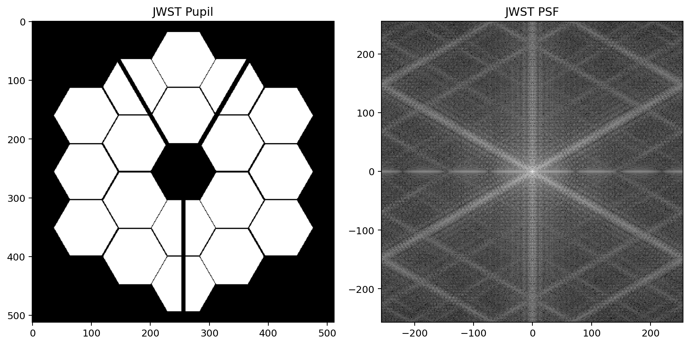
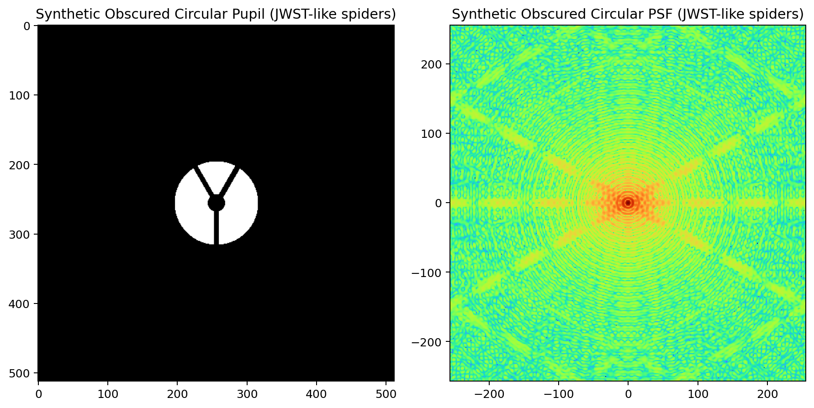
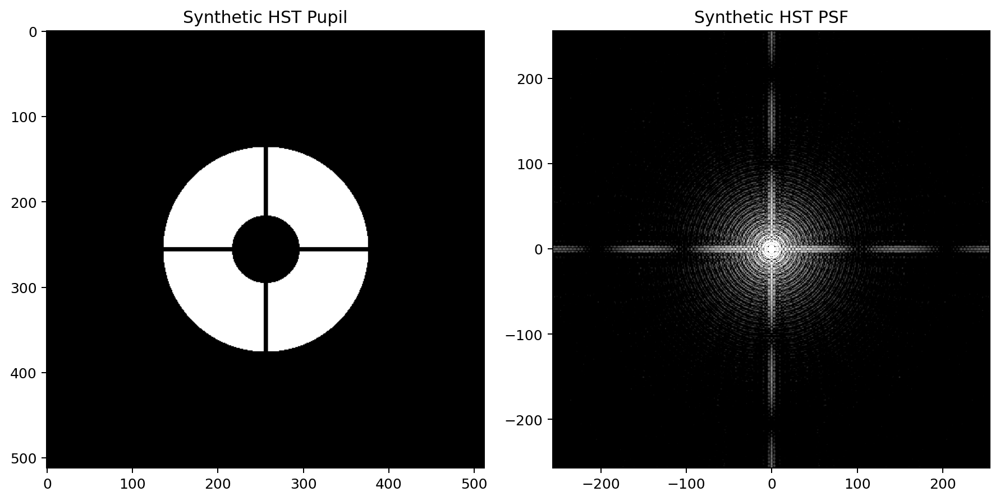
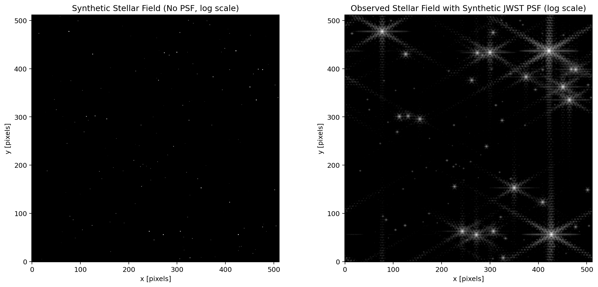
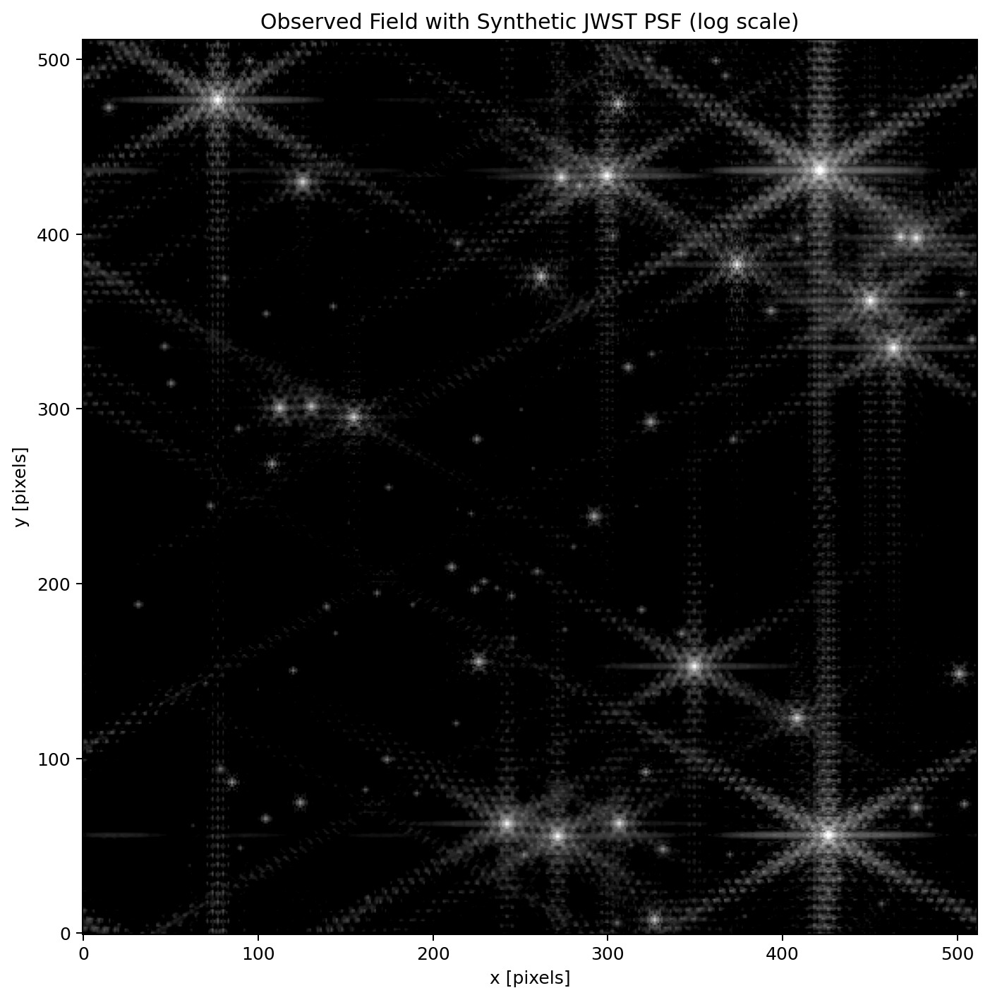
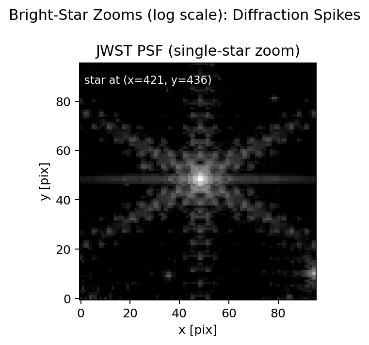

# psf-modeling

`psf-modeling` est une simulation pédagogique de fonctions d’étalement du point (PSF) en optique de Fourier. Le projet se concentre sur des pupilles simplifiées de type JWST et HST, et inclut aussi des géométries alternatives, comme des pupilles circulaires, hexagonales ou circulaires obscurées.

## Objectif du projet

Ce dépôt illustre la manière dont la géométrie d’une pupille de télescope, notamment la segmentation, l’obstruction centrale et les spiders, se traduit dans le plan image par une PSF structurée avec un cœur, des anneaux et des aigrettes de diffraction. L’idée est de proposer à la fois une base de simulation reproductible et une lecture physique intuitive des signatures observées sur les figures.

## Hypothèses physiques

Le cadre retenu est volontairement simple afin de rester lisible et pédagogique. Le calcul est réalisé dans le régime de Fraunhofer (champ lointain), avec un modèle monochromatique et une pupille binaire de transmission 0/1. Les aberrations de phase instrumentales ne sont pas encore prises en compte. Malgré ces simplifications, le modèle reproduit correctement les signatures de diffraction principales attendues.

## Méthode : de la pupille à la PSF

La méthode suit un enchaînement direct. On construit d’abord une carte 2D de pupille, soit en version JWST simplifiée, soit avec une géométrie alternative. Le champ image complexe est ensuite obtenu par transformée de Fourier 2D selon la relation \(E \propto \mathcal{F}\{P\}\), puis la PSF d’intensité est calculée avec \(\mathrm{PSF} = |E|^2\). La PSF est normalisée à flux total unité, puis affichée en échelle logarithmique pour visualiser simultanément le cœur et les structures faibles.

## Figures principales

La figure `figures/jwst_pupil_psf.png` présente la pupille JWST simplifiée et la PSF associée. La pupille segmentée avec spiders produit des signatures conformes à ce que l’on attend d’un système segmenté, avec des aigrettes marquées et des structures secondaires liées à la segmentation.



La figure `figures/other_pupil_psf.png` montre un exemple de pupille synthétique alternative et la PSF correspondante. Elle met en évidence l’influence directe de la géométrie de pupille sur la distribution d’énergie, en particulier sur la forme du cœur, la structure des anneaux et la directionnalité des aigrettes.



La figure `figures/hst_pupil_psf.png` présente une pupille HST simplifiée, modélisée comme une ouverture circulaire avec obstruction centrale et spiders orthogonaux. La PSF associée retrouve une structure de diffraction typique d’un télescope à pupille circulaire obscurée avec aigrettes bien marquées.



## Convolution d’un champ stellaire avec la PSF JWST

Le projet inclut aussi une scène stellaire synthétique, puis sa convolution par la PSF JWST. La figure `figures/observed_field_initial_vs_jwst.png` affiche côte à côte le champ initial et le champ observé après convolution, tous deux en échelle logarithmique pour conserver à la fois le cœur des étoiles et les structures de faible intensité.



La figure `figures/observed_field_jwst_only.png` montre l’image convoluée seule. On voit que la PSF redistribue le flux autour des sources ponctuelles et introduit la structure directionnelle liée à la géométrie de la pupille.



La figure `figures/observed_field_jwst_star_zoom.png` est un zoom unique centré sur l’étoile de coordonnées `(x=421, y=436)`. Ce zoom met en évidence les aigrettes de diffraction et permet une lecture locale plus claire de la réponse instrumentale.



## Utilisation rapide

```bash
python PSF_JWST.py --no-show
python PSF_HST.py --no-show
python view_PSF.py --no-show
python others_PSF.py --no-show
python scripts/generate_synthetic_scene.py --no-show --n-galaxies 0 --n-diffuse 0
python scripts/apply_jwst_psf_to_scene.py --no-show
```

## Structure du dépôt

Les scripts `PSF_JWST.py` et `PSF_HST.py` génèrent respectivement des pupilles simplifiées JWST et HST, calculent les PSF et produisent les figures principales. Le script `view_PSF.py` recharge une pupille sauvegardée et affiche la PSF correspondante, tandis que `others_PSF.py` permet d’explorer d’autres géométries. Le code modulaire est regroupé dans `src/psf_modeling/`, les figures sont stockées dans `figures/` et les tests unitaires dans `tests/`.

## Limites actuelles

Le projet ne traite pas encore les effets polychromatiques, les aberrations de phase ni la calibration en unités angulaires instrumentales (arcsec, λ/D).
